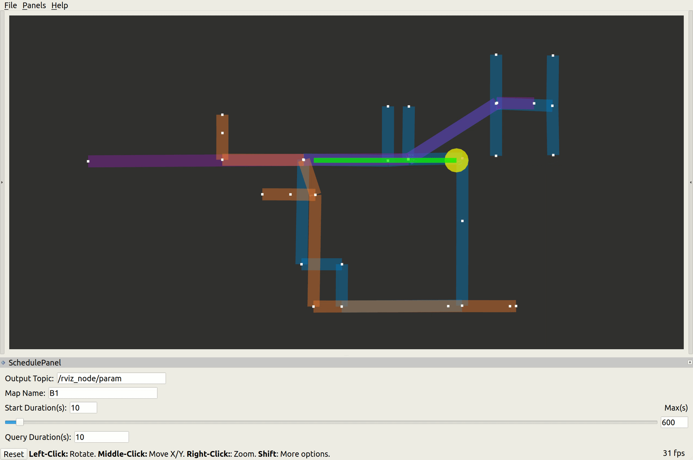

# rmf_schedule_visualizer

A visualizer for robot trajectories in the `rmf schedule database` and live locations of robots, if available. Users may query trajectories in different maps and view the schedule at a future instance.



# System Requirements

The visualizer is developed and tested on
[Ubuntu 18.04 LTS](http://releases.ubuntu.com/18.04/) with 
[ROS2 Eloquent](https://index.ros.org/doc/ros2/Installation/#installationguide). It can also be run on the `dashing` distribution of ROS2.

# Installation 
```
sudo apt-get update 
sudo apt-get install libeigen3-dev libccd-dev libfcl-dev libyaml-cpp-dev ros-eloquent-rviz2 libwebsocketpp-dev libboost-all-dev -y
mkdir -p ~/ws_rmf/src
cd ~/ws_rmf/src
git clone https://github.com/osrf/rmf_core.git
git clone https://github.com/osrf/traffic_editor.git
git clone https://github.com/osrf/rmf_schedule_visualizer.git
cd ~/ws_rmf
source /opt/ros/eloquent/setup.bash
colcon build
```

# Running 

To launch the visualizer
```
ros2 launch visualizer visualizer.xml
```

An active `rmf_traffic_schedule` node is prerequisite for the visualizer to initialize. If a schedule node is not running, it can be started with the command. Note: More than one schedule node must not be running at any given instance. 
```
ros2 run rmf_traffic_ros2 rmf_traffic_schedule
```

MarkerArray messages are published over three topics,
1)`/map_markers` visualizes the nav graphs, waypoints and waypoint labels. Requires `Transient Local` durability
2)`/schedule_markers` visualizes planned trajectory of the robots in the rmf_schedule
3)`fleet_markers` visualizes the current pose of robots as published over `/fleet_states`

The visualizer will also render navigation graphs that are published by `building_map_server` in the `building_map_tools` package of `traffic_editor`. The live locations of robots as published over`/fleet_states` by various `fleet adapters`are represented by the purple spheres.

The visualizer node queries for trajectories in the schedule from the current instance in time until a duration of `query_duration`(s) into the future. The trajectories are also filtered based on a`map_name`. The predicted position of the robot (yellow cylinder) and its conflict-free path (green) are then visualized in RViz2. The schedule can be viewed `start_duration` seconds from the current instance on time by adjusting the slider appropraitely. The default values of `map_name`, `query_duration` and `start_duration` are "B1", 600s and 0s respectively. These values can be modified through the cusom `SchedulePanel` panel GUI in Rviz2. 

# Websocket Server for Custom UIs 
For developers looking to create custom UIs outside of the ROS2 environment, this repository provides a websocket server to exchange information contained in an active rmf schedule database. This may primarily be used to query for robot trajectories in the schedule along with conflict information if any. The format for various requests and corresponding responses are described below.

To start the websocket server,

```ros2 launch visualizer server.xml```

The default port_number of the websocet server is `8006`. 

## Sample Client Requests

### Server Time
To receive the current server time in milliseconds
```
{"request":"time","param":{}}

```
Sample server response
```
{"response":"time","values":[167165000000]}
```

### Trajectories in RMF Schedule
To receive a list of active trajectories and conflicts if any between `now` and until a `duration`(milliseconds)
```
{"request":"trajectory","param":{"map_name":"L1","duration":60000, "trim":true}}
```

If `trim` is `false`, data of the complete trajectory is forwarded even if there is only partial overlap in the query duration.

Sample server response 
```
{
  "response":"trajectory",
  "values":[{
    "robot_name":"magni1",
    "fleet_name:"magni",
    "shape":"circle",
    "dimensions":0.3,
    "id":310,
    "segments":[
      {"t":336857,"v":[0.018886815933120995,0.4996431607843137,0.0],"x":[11.610485884950174,-8.054053944114406,-1.6085801124572754]},
      {"t":338700,"v":[0.01888681593558913,0.4996431608496359,0.0],"x":[11.645306833719362,-7.132879672805034,-1.6085801124572754]}]}],
  "conflicts":[]
}

```
Here `segments` is a list of dictionaries containing parameters of the knots in the piecewise cubic spline trajectory. `x` stores positional data in [x, y,theta] coordinates while `v`, the velocity data in the same coordinates. `t` is the time recorded in milliseconds.
